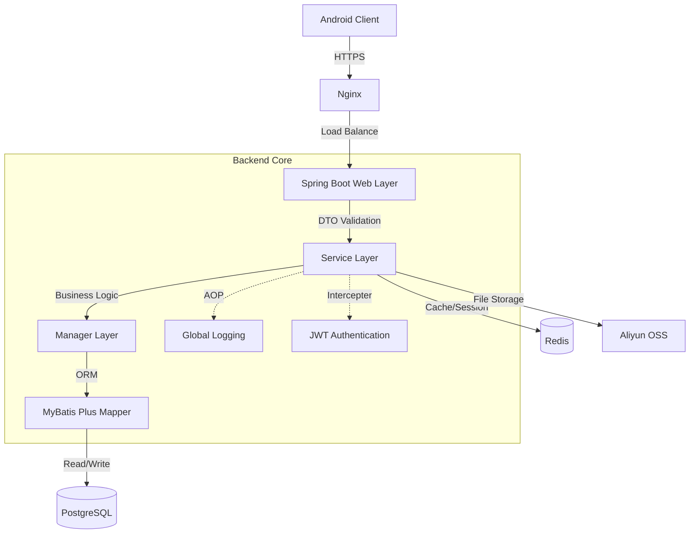

# 🔥 轻练 (QingLian) - 健身社交平台后端系统

> 🎓 **腾讯菁英班客户端开发大作业** | 个人技术作品集
> 
> 基于 **Spring Boot 3 + PostgreSQL** 构建的高性能健身社交后端服务。


## 📖 项目背景 (Background)

本项目是一款面向年轻群体的健身社交 App 后端系统。除了基础的 CRUD 业务，项目重点解决用户的**健身数据量化**与**社交互动实时性**问题。

作为主要开发者，我负责了从**数据库选型建模**、**API 接口设计**到**核心业务逻辑实现**的全过程。该项目是我实践 Spring 生态与分布式架构思想的练手之作。

---

## 🏗 系统架构设计 (Architecture)

项目采用经典的分层架构设计，遵循 **RESTful API** 规范，保证了各层级的职责单一与低耦合。



### 💻 核心技术栈选型 (Tech Stack)

| 技术领域 | 选型 | 选型理由 (面试重点) |
| :--- | :--- | :--- |
| **基础框架** | Spring Boot 3.5 | 利用自动装配简化配置，快速构建生产级微服务应用。 |
| **数据持久层** | MyBatis Plus | 相比 JPA 更灵活的 SQL 控制能力，结合 Wrapper 快速实现复杂查询。 |
| **数据库** | **PostgreSQL** | **亮点**：利用其原生 UUID 支持解决主键安全性问题；利用 Trigger 实现自动化字段维护。 |
| **缓存中间件** | Redis | 用于热点数据（如排行榜、Token黑名单）缓存，减轻 DB 压力。 |
| **鉴权安全** | JWT (Java Web Token) | 实现**无状态认证**，避免服务端 Session 存储瓶颈，适配移动端开发。 |
| **对象存储** | 阿里云 OSS | 将用户头像、动态图片/视频与业务服务器分离，提升 I/O 性能。 |

---

## 💾 数据库设计亮点 (Database Design)

在数据库设计层面，我没有使用传统的自增 ID，而是引入了更符合分布式规范的设计。

### 1. 全局唯一标识 (UUID)
所有核心表（User, Plans, Posts）的主键均采用 PostgreSQL 的 `uuid-ossp` 扩展生成。
```sql
-- 示例：用户表主键定义
user_id UUID PRIMARY KEY DEFAULT uuid_generate_v4()
```
*   **优势**：防止 ID 遍历攻击（ID enumeration attack），不仅安全性更高，且天然支持未来的分库分表与数据迁移。

### 2. 自动化审计 (Triggers)
利用 PL/pgSQL 编写存储过程，实现了 `updated_at` 字段的自动化维护，将数据维护逻辑下沉至数据库层，保证数据一致性。
```sql
CREATE OR REPLACE FUNCTION update_updated_at_column()
RETURNS TRIGGER AS $$
BEGIN
    NEW.updated_at = CURRENT_TIMESTAMP;
    RETURN NEW;
END;
$$ language 'plpgsql';
```

---

## ⚡ 关键难点与解决方案 (Key Challenges)

### 1. 优雅的参数校验机制
**问题**：Controller 层充斥着大量的 `if-else` 判断（如性别判断、手机号格式），导致代码臃肿，核心业务逻辑不清晰。
**解决**：
*   **AOP 切面思想**：利用 Java 注解与 Hibernate Validator。
*   **自定义注解**：开发了 `@Gender` 等自定义注解，实现了 `ConstraintValidator` 接口。
*   **效果**：在参数绑定阶段自动拦截非法请求，业务代码行数减少约 30%。
```java
// 使用示例
@Gender(message = "性别必须为'男'或'女'")
private String gender;
```

### 2. 社交排行榜的实时计算
**问题**：随着用户运动数据增多，实时统计“好友圈运动时长排名”涉及多表关联（User + Friendship + WorkoutRecords），性能开销大。
**解决**：
*   **当前策略**：编写高效的 MyBatis 聚合 SQL，利用 `GROUP BY` 和 `SUM` 函数进行统计。
*   **优化思路**（储备）：引入 Redis 的 `ZSet` (Sorted Set) 数据结构。以 `userId` 为 Member，`duration` 为 Score，实现 O(logN) 复杂度的实时排名获取。

### 3. 安全的鉴权体系
**问题**：如何确保用户数据的安全性，防止水平越权？
**解决**：
*   **密码安全**：采用 **MD5 + Salt** (加盐) 策略存储用户密码，防止彩虹表破解。
*   **Token 设计**：封装 `JwtUtil`，在 Token Payload 中仅存储非敏感数据（User ID）。
*   **拦截器**：配置 `HandlerInterceptor` 对所有非公开接口进行统一拦截，从 Header 中解析用户信息并注入 `ThreadLocal`，供下游业务使用。

---

## 📂 项目结构 (Project Structure)

项目遵循标准的 Maven 工程结构，注重包的分层与命名规范 (Package by Layer)。

```text
com.yychainsaw
├── anno          # 自定义校验注解 (@Gender)
├── config        # 全局配置类 (WebMVC, MyBatis)
├── controller    # 表现层 (统一封装 Result<T>)
├── pojo          # 领域模型
│   ├── dto       # 数据传输对象 (接收前端参数)
│   ├── entity    # 数据库实体 (对应 DB 表)
│   └── vo        # 视图对象 (返回给前端的数据，隐藏敏感字段)
├── mapper        # 数据访问层 (DAO)
├── service       # 业务逻辑层 (事务控制 @Transactional)
└── utils         # 核心工具箱 (JWT, MD5, OSS)
```

---

## 🚀 后续优化规划 (Roadmap)

如果将该项目推向生产环境，我计划进行以下工程化升级：

1.  **容器化部署**：编写 Dockerfile，使用 Docker Compose 编排 App、PostgreSQL 和 Redis 容器，实现一键部署。
2.  **CI/CD 流水线**：引入 GitHub Actions，实现代码提交后的自动构建与单元测试运行。
3.  **单元测试覆盖**：补充 JUnit 5 测试用例，重点覆盖 `Service` 层核心业务逻辑，确保代码健壮性。
4.  **API 文档自动化**：集成 Swagger/Knife4j，自动生成在线接口文档，降低前后端沟通成本。

---

**Developed with ❤️ by [YYchainsAw](https://github.com/YYchainsAw)**
